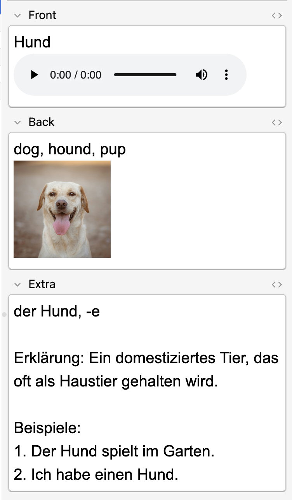
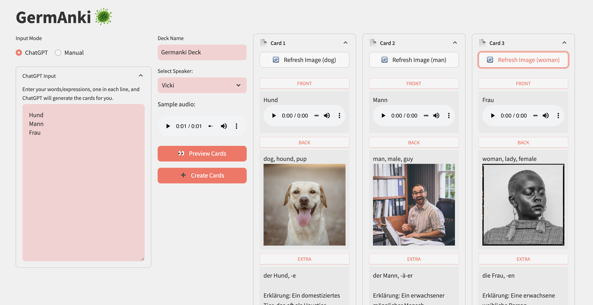

# GermAnki
Make Anki German vocabulary card creation less time-consuming with GermAnki.

This is only possible thanks to [AnkiConnect](https://foosoft.net/projects/anki-connect/), [TTSMP3](https://ttsmp3.com/), and [Pexels](https://www.pexels.com/). Thanks!

# Features
1. Automatically include pronunciation audio to your card.
2. Automatically include a relevant image to your card.

# Customizations
## Change Speaker's Voice
Choose among available voices to pronounce the German text the front of your card.

## Refresh Image
Is the first image pick not good enough? Click the _Refresh Images_ button and get a new random one.

# Requirements
1. Install the [AnkiConnect](https://ankiweb.net/shared/info/2055492159) add-on.
2. Add support these three fields in your `Basic` Anki card type: `Front`, `Back`, and `Extra`.

Optional:
1. Create an account on [Pexels](https://www.pexels.com/) and create your API key. It's free. Then set the environment variable `PEXELS_API_KEY` to your key.

    **Required to have images in your cards**

2. Create an account on [ChatGPT](https://chatgpt.com/) to generate inputs for you.

# Run
1. Clone this repository
2. Install [poetry](https://python-poetry.org/docs/)

Then, inside the repository:
```sh
# install the dependencies
poetry install
# set your Pexels API key if you have one
export PEXELS_API_KEY=<your-api-key>
# run the app
poetry run streamlit run src/germanki/app.py
```
Then go to http://localhost:8503/.

# Anki Cards
By default, this is how the GermAnki is programmed to work.

**Front:**
- The German word.
- A pronunciation audio.
**Back:**
- The English translations.
- A relevant picture to help with memorization.
**Extra:**
- Description, example, and other information relevant for the word type e.g. perfect form of verbs, article and plural form of nouns.

Example:


# Tips
## ChatGPT/LLM
Use ChatGPT or similar tool to generate the inputs for your card with a simple prompt. All you need to provide are the German words you would like to learn.

### Prompt
```
For each German word/phrase, provide:
- A brief German description on its own line.
- An example sentence in German using Goethe A2 vocabulary.
- Direct English translations (2–4 words) in one line.

For nouns:
- Include gender (der, die, das) and plural form (if applicable).

For verbs:
- Include infinitive and Perfekt (with the auxiliary verb "haben" or "sein").
- Specify if the verb requires Dativ or Genitiv (e.g., "sich (Dat.) merken").

For expressions:
- Provide only translation and example.

Output results in YAML format. Example:

- front: begleiten
  back: to accompany, to go with
  extra: |
    haben + begleitet
    Mit jemandem mitgehen oder zusammen sein.
    Beispiel: Sie hat ihn zum Arzt begleitet.

Now do it for these words:
Hund
Stuhl
studieren
gefallen
ich freue mich
zufrieden sein mit
```

### Example result
```yaml
- front: Hund
  back: dog
  extra: |
    der Hund, die Hunde
    Ein Tier, das oft als Haustier gehalten wird.
    Beispiel: Mein Hund spielt im Garten.

- front: Stuhl
  back: chair
  extra: |
    der Stuhl, die Stühle
    Ein Möbelstück, auf dem man sitzt.
    Beispiel: Der Stuhl ist sehr bequem.

- front: studieren
  back: to study
  extra: |
    haben + studiert
    An einer Universität oder Hochschule lernen.
    Beispiel: Er studiert Mathematik in Berlin.

- front: gefallen
  back: to like, to please
  extra: |
    haben + gefallen
    Etwas oder jemand findet man schön oder gut.
    Beispiel: Das Kleid gefällt mir sehr.

- front: ich freue mich
  back: I am happy, I look forward to
  extra: |
    Expression
    Ausdruck der Freude oder Vorfreude.
    Beispiel: Ich freue mich auf den Urlaub.

- front: zufrieden sein mit
  back: to be satisfied with
  extra: |
    sein + zufrieden gewesen
    Mit etwas oder jemandem glücklich oder einverstanden sein.
    Beispiel: Sie ist mit ihrem Job zufrieden.
```

This result can be pasted directly onto GermAnki.

### Preview


### Generated Anki Card


# TODO
* Integrate with ChatGPT API to improve the experience.
* Alternatively, scrape `https://www.verbformen.de/` or `https://www.duden.de/` for verb forms and translation.
* Enable card deletion in the preview. e.g. to avoid card duplicate errors.
* Add fields and buttons to update values of the `Config` class.
* Add button to toggle image download.
* Allow card editing in preview
* Detect your Anki Decks and provide a drop-down menu to select it.
* Detect card duplicates in the preview.
* Provide more better clearer feedback regarding backend errors. e.g. pop-up windows.
* Load existing cards for editing.
* Handle exceptions properly
* Unit tests
